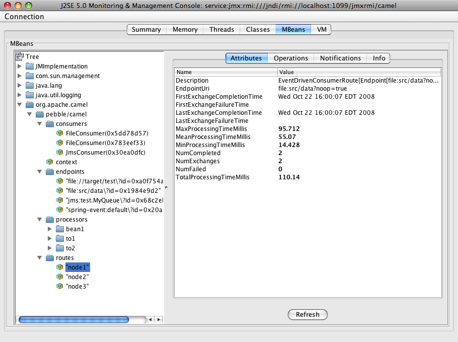
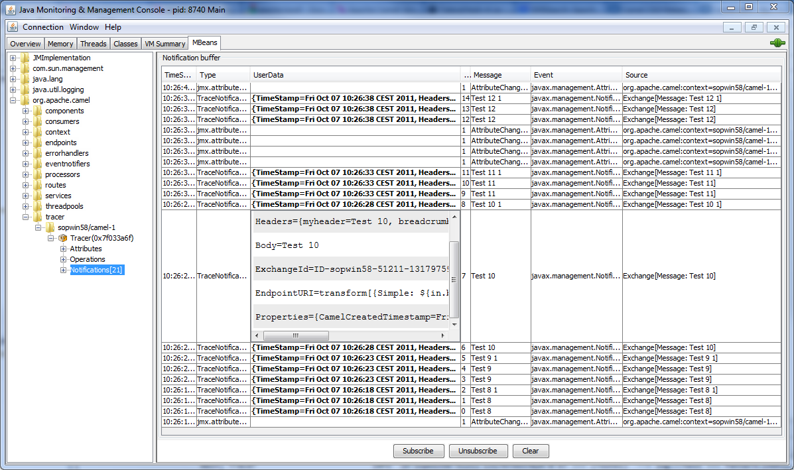

== JMX Component
ifdef::env-github[]
*Available as of Camel version 2.6.0*

:caution-caption: :boom:
:important-caption: :exclamation:
:note-caption: :information_source:
:tip-caption: :bulb:
:warning-caption: :warning:
endif::[]

### Camel JMX

Apache Camel has extensive support for JMX to allow you to monitor and
control the Camel managed objects with a JMX client.

Camel also provides a link:jmx.html[JMX] component that allows you to
subscribe to MBean notifications. This page is about how to manage and
monitor Camel using JMX.

### Options

// component options: START
The JMX component has no options.
// component options: END

// endpoint options: START
The JMX endpoint is configured using URI syntax:

----
jmx:serverURL
----

with the following path and query parameters:

==== Path Parameters (1 parameters):

[width="100%",cols="2,5,^1,2",options="header"]
|===
| Name | Description | Default | Type
| *serverURL* | server url comes from the remaining endpoint |  | String
|===

==== Query Parameters (29 parameters):

[width="100%",cols="2,5,^1,2",options="header"]
|===
| Name | Description | Default | Type
| *bridgeErrorHandler* (consumer) | Allows for bridging the consumer to the Camel routing Error Handler which mean any exceptions occurred while the consumer is trying to pickup incoming messages or the likes will now be processed as a message and handled by the routing Error Handler. By default the consumer will use the org.apache.camel.spi.ExceptionHandler to deal with exceptions that will be logged at WARN or ERROR level and ignored. | false | boolean
| *format* (consumer) | URI Property: Format for the message body. Either xml or raw. If xml the notification is serialized to xml. If raw then the raw java object is set as the body. | xml | String
| *granularityPeriod* (consumer) | URI Property: monitor types only The frequency to poll the bean to check the monitor. | 10000 | long
| *monitorType* (consumer) | URI Property: monitor types only The type of monitor to create. One of string gauge counter. |  | String
| *objectDomain* (consumer) | *Required* URI Property: The domain for the mbean you're connecting to |  | String
| *objectName* (consumer) | URI Property: The name key for the mbean you're connecting to. This value is mutually exclusive with the object properties that get passed. |  | String
| *observedAttribute* (consumer) | URI Property: monitor types only The attribute to observe for the monitor bean. |  | String
| *exceptionHandler* (consumer) | To let the consumer use a custom ExceptionHandler. Notice if the option bridgeErrorHandler is enabled then this options is not in use. By default the consumer will deal with exceptions that will be logged at WARN or ERROR level and ignored. |  | ExceptionHandler
| *exchangePattern* (consumer) | Sets the exchange pattern when the consumer creates an exchange. |  | ExchangePattern
| *handback* (advanced) | URI Property: Value to handback to the listener when a notification is received. This value will be put in the message header with the key jmx.handback |  | Object
| *notificationFilter* (advanced) | URI Property: Reference to a bean that implements the NotificationFilter. |  | NotificationFilter
| *objectProperties* (advanced) | URI Property: properties for the object name. These values will be used if the objectName param is not set |  | Map
| *reconnectDelay* (advanced) | URI Property: The number of seconds to wait before attempting to retry establishment of the initial connection or attempt to reconnect a lost connection | 10 | int
| *reconnectOnConnection Failure* (advanced) | URI Property: If true the consumer will attempt to reconnect to the JMX server when any connection failure occurs. The consumer will attempt to re-establish the JMX connection every 'x' seconds until the connection is made-- where 'x' is the configured reconnectionDelay | false | boolean
| *synchronous* (advanced) | Sets whether synchronous processing should be strictly used or Camel is allowed to use asynchronous processing (if supported). | false | boolean
| *testConnectionOnStartup* (advanced) | URI Property: If true the consumer will throw an exception if unable to establish the JMX connection upon startup. If false the consumer will attempt to establish the JMX connection every 'x' seconds until the connection is made -- where 'x' is the configured reconnectionDelay | true | boolean
| *initThreshold* (counter) | URI Property: counter monitor only Initial threshold for the monitor. The value must exceed this before notifications are fired. |  | int
| *modulus* (counter) | URI Property: counter monitor only The value at which the counter is reset to zero |  | int
| *offset* (counter) | URI Property: counter monitor only The amount to increment the threshold after it's been exceeded. |  | int
| *differenceMode* (gauge) | URI Property: counter gauge monitor only If true then the value reported in the notification is the difference from the threshold as opposed to the value itself. | false | boolean
| *notifyHigh* (gauge) | URI Property: gauge monitor only If true the gauge will fire a notification when the high threshold is exceeded | false | boolean
| *notifyLow* (gauge) | URI Property: gauge monitor only If true the gauge will fire a notification when the low threshold is exceeded | false | boolean
| *thresholdHigh* (gauge) | URI Property: gauge monitor only Value for the gauge's high threshold |  | Double
| *thresholdLow* (gauge) | URI Property: gauge monitor only Value for the gauge's low threshold |  | Double
| *password* (security) | URI Property: credentials for making a remote connection |  | String
| *user* (security) | URI Property: credentials for making a remote connection |  | String
| *notifyDiffer* (string) | URI Property: string monitor only If true the string monitor will fire a notification when the string attribute differs from the string to compare. | false | boolean
| *notifyMatch* (string) | URI Property: string monitor only If true the string monitor will fire a notification when the string attribute matches the string to compare. | false | boolean
| *stringToCompare* (string) | URI Property: string monitor only Value for the string monitor's string to compare. |  | String
|===
// endpoint options: END

### Activating JMX in Camel

[NOTE]
====
*Spring JAR dependency, required for Camel 2.8 or older*

`spring-context.jar`, `spring-aop.jar`, `spring-beans.jar`, and
`spring-core.jar` are needed on the classpath by Camel to be able to use
JMX instrumentation. If these .jars are not on the classpath, Camel will
fallback to non JMX mode. This situation is logged at `WARN` level using
logger name `org.apache.camel.impl.DefaultCamelContext`.

From *Camel 2.9* onwards, the Spring JARs are *no* longer required to
run Camel in JMX mode.
====

#### Using JMX to manage Apache Camel

By default, JMX instrumentation agent is enabled in Camel, which means
that Camel runtime creates and registers MBean management objects with a
`MBeanServer` instance in the VM. This allows Camel users to instantly
obtain insights into how Camel routes perform down to the individual
processor level.

The supported types of management objects are
http://camel.apache.org/maven/current/camel-core/apidocs/org/apache/camel/management/mbean/ManagedEndpoint.html[endpoint],
http://camel.apache.org/maven/current/camel-core/apidocs/org/apache/camel/management/mbean/ManagedRoute.html[route],
http://camel.apache.org/maven/current/camel-core/apidocs/org/apache/camel/management/mbean/ManagedService.html[service],
and
http://camel.apache.org/maven/current/camel-core/apidocs/org/apache/camel/management/mbean/ManagedProcessor.html[processor].
Some of these management objects also expose lifecycle operations in
addition to performance counter attributes.

The
http://camel.apache.org/maven/current/camel-core/apidocs/org/apache/camel/management/DefaultManagementNamingStrategy.html[`DefaultManagementNamingStrategy`]
is the default naming strategy which builds object names used for MBean
registration. By default, `org.apache.camel` is the domain name for all
object names created by `CamelNamingStrategy`. The domain name of the
MBean object can be configured by Java VM system property:

[source]
----
-Dorg.apache.camel.jmx.mbeanObjectDomainName=your.domain.name
----

Or, by adding a `jmxAgent` element inside the camelContext element in
Spring configuration:

[source,xml]
----
<camelContext id="camel" xmlns="http://camel.apache.org/schema/spring">
  <jmxAgent id="agent" mbeanObjectDomainName="your.domain.name"/>
    ...
</camelContext>
----

Spring configuration always takes precedence over system properties when
they both present. It is true for all JMX related configurations.

#### Disabling JMX instrumentation agent in Camel

You can disable JMX instrumentation agent by setting the Java VM system
property as follow:

[source]
----
-Dorg.apache.camel.jmx.disabled=true
----

The property value is treated as `boolean`.

Or, by adding a `jmxAgent` element inside the `camelContext` element in
Spring configuration:

[source,xml]
----
<camelContext id="camel" xmlns="http://camel.apache.org/schema/spring">
  <jmxAgent id="agent" disabled="true"/>
    ...
</camelContext>
----

Or in *Camel 2.1* its a bit easier (not having to use JVM system
property) if using pure Java as you can disable it as follows:

[source,java]
----
CamelContext camel = new DefaultCamelContext();
camel.disableJMX();
----

#### Locating a MBeanServer in the Java VM

Each CamelContext can have an instance of
http://camel.apache.org/maven/current/camel-core/apidocs/org/apache/camel/spi/InstrumentationAgent.html[`InstrumentationAgent`]
wrapped inside the
http://camel.apache.org/maven/current/camel-core/apidocs/org/apache/camel/management/InstrumentationLifecycleStrategy.html[`InstrumentationLifecycleStrategy`].
The InstrumentationAgent is the object that interfaces with a
http://java.sun.com/j2se/1.5.0/docs/api/javax/management/MBeanServer.html[`MBeanServer`]
to register / unregister Camel MBeans. Multiple
CamelContexts / InstrumentationAgents can / should share a `MBeanServer`. By
default, Camel runtime picks the first `MBeanServer` returned by
http://java.sun.com/j2se/1.5.0/docs/api/javax/management/MBeanServerFactory.html#findMBeanServer(java.lang.String)[MBeanServerFactory.findMBeanServer
method] that matches the default domain name of `org.apache.camel`.

You may want to change the default domain name to match the
`MBeanServer` instance that you are already using in your application.
Especially, if your `MBeanServer` is attached to a JMX connector server,
you will not need to create a connector server in Camel.

You can configure the matching default domain name via system property.

[source]
----
-Dorg.apache.camel.jmx.mbeanServerDefaultDomain=<your.domain.name>
----

Or, by adding a `jmxAgent` element inside the camelContext element in
Spring configuration:

[source,xml]
----
<camelContext id="camel" xmlns="http://camel.apache.org/schema/spring">
  <jmxAgent id="agent" mbeanServerDefaultDomain="your.domain.name"/>
    ...
</camelContext>
----

If no matching `MBeanServer` can be found, a new one is created and the
new `MBeanServer`'s default domain name is set according to the default
and configuration as mentioned above.

It is also possible to use the
http://java.sun.com/j2se/1.5.0/docs/api/java/lang/management/ManagementFactory.html#getPlatformMBeanServer()[`PlatformMBeanServer`]
when it is desirable to manage JVM MBeans by setting the system
property. The `MBeanServer` default domain name configuration is ignored
as it is not applicable.

[CAUTION]
Starting in next release (1.5), the default
value of `usePlatformMBeanServer` will be changed to `true`. You can set
the property to `false` to disable using platform `MBeanServer`.

[source]
----
-Dorg.apache.camel.jmx.usePlatformMBeanServer=True
----

Or, by adding a `jmxAgent` element inside the `camelContext` element in
Spring configuration:

[source,xml]
----
<camelContext id="camel" xmlns="http://camel.apache.org/schema/spring">
  <jmxAgent id="agent" usePlatformMBeanServer="true"/>
    ...
</camelContext>
----

#### Creating JMX RMI Connector Server

JMX connector server enables MBeans to be remotely managed by a JMX
client such as JConsole; Camel JMX RMI connector server can be
optionally turned on by setting system property and the `MBeanServer`
used by Camel is attached to that connector server.

[source]
----
-Dorg.apache.camel.jmx.createRmiConnector=True
----

Or, by adding a `jmxAgent` element inside the `camelContext` element in
Spring configuration:

[source,xml]
----
<camelContext id="camel" xmlns="http://camel.apache.org/schema/spring">
  <jmxAgent id="agent" createConnector="true"/>
    ...
</camelContext>
----

#### JMX Service URL

The default JMX Service URL has the format:

[source]
----
service:jmx:rmi:///jndi/rmi://localhost:<registryPort>/<serviceUrlPath>
----

`registryPort` is the RMI registry port and the default value is
`1099`.

You can set the RMI registry port by system property.

[source]
----
-Dorg.apache.camel.jmx.rmiConnector.registryPort=<port number>
----

Or, by adding a `jmxAgent` element inside the `camelContext` element in
Spring configuration:

[source,xml]
----
<camelContext id="camel" xmlns="http://camel.apache.org/schema/spring">
  <jmxAgent id="agent" createConnector="true" registryPort="port number"/>
    ...
</camelContext>
----

`serviceUrlPath` is the path name in the URL and the default value is
`/jmxrmi/camel`.

You can set the service URL path by system property.

[source]
----
-Dorg.apache.camel.jmx.serviceUrlPath=<path>
----

[TIP]
====
*Setting ManagementAgent settings in Java*

In *Camel 2.4* onwards you can also set the various options on the
`ManagementAgent`:

[source,java]
----
context.getManagementStrategy().getManagementAgent().setServiceUrlPath("/foo/bar");
context.getManagementStrategy().getManagementAgent().setRegistryPort(2113);
context.getManagementStrategy().getManagementAgent().setCreateConnector(true);
----

====

Or, by adding a `jmxAgent` element inside the camelContext element in
Spring configuration:

[source,xml]
----
<camelContext id="camel" xmlns="http://camel.apache.org/schema/spring">
  <jmxAgent id="agent" createConnector="true" serviceUrlPath="path"/>
    ...
</camelContext>
----

By default, RMI server object listens on a dynamically generated port,
which can be a problem for connections established through a firewall.
In such situations, RMI connection port can be explicitly set by the
system property.

[source]
----
-Dorg.apache.camel.jmx.rmiConnector.connectorPort=<port number>
----

Or, by adding a `jmxAgent` element inside the `camelContext` element in
Spring configuration:

[source,xml]
----
<camelContext id="camel" xmlns="http://activemq.apache.org/camel/schema/spring">
  <jmxAgent id="agent" createConnector="true" connectorPort="port number"/>
    ...
</camelContext>
----

When the connector port option is set, the JMX service URL will become:

[source]
----
service:jmx:rmi://localhost:<connectorPort>/jndi/rmi://localhost:<registryPort>/<serviceUrlPath>
----

#### The System Properties for Camel JMX support

[width="100%",cols="1m,1,3",options="header",]
|=======================================================================
|Property Name |value |Description
|org.apache.camel.jmx |`true` or `false` |if is `true`, it will enable jmx
feature in Camel
|=======================================================================

See more system properties in this section below: _jmxAgent Properties
Reference_.

#### How to use authentication with JMX

JMX in the JDK have features for authentication and also for using
secure connections over SSL. You have to refer to the SUN documentation
how to use this:

* http://java.sun.com/j2se/1.5.0/docs/guide/management/agent.html
* http://java.sun.com/javase/6/docs/technotes/guides/management/agent.html

#### JMX inside an Application Server

#### Tomcat 6

See http://tomcat.apache.org/tomcat-6.0-doc/monitoring.html[this page]
for details about enabling JMX in Tomcat.

In short, modify your catalina.sh (or catalina.bat in Windows) file to
set the following options...

[source]
----
 set CATALINA_OPTS=-Dcom.sun.management.jmxremote \
    -Dcom.sun.management.jmxremote.port=1099 \
    -Dcom.sun.management.jmxremote.ssl=false \
    -Dcom.sun.management.jmxremote.authenticate=false
----

#### JBoss AS 4

By default JBoss creates its own `MBeanServer`. To allow Camel to expose
to the same server follow these steps:

. Tell Camel to use the Platform `MBeanServer` (This defaults to true
in Camel 1.5)

[source,xml]
----
<camel:camelContext id="camelContext">
  <camel:jmxAgent id="jmxAgent" mbeanObjectDomainName="org.yourname" usePlatformMBeanServer="true"  />
</camel:camelContext>
----

. Alter your JBoss instance to use the Platform `MBeanServer`. +
Add the following property to your `JAVA_OPTS` by editing `run.sh` or
`run.conf` `-Djboss.platform.mbeanserver`. See
http://wiki.jboss.org/wiki/JBossMBeansInJConsole

#### WebSphere

Alter the `mbeanServerDefaultDomain` to be `WebSphere`:

[source,xml]
----
<camel:jmxAgent id="agent" createConnector="true" mbeanObjectDomainName="org.yourname" usePlatformMBeanServer="false" mbeanServerDefaultDomain="WebSphere"/>
----

#### Oracle OC4j

The Oracle OC4J J2EE application server will not allow Camel to access
the platform `MBeanServer`. You can identify this in the log as Camel
will log a `WARNING`.

[source]
----
xxx xx, xxxx xx:xx:xx xx org.apache.camel.management.InstrumentationLifecycleStrategy onContextStart
WARNING: Could not register CamelContext MBean
java.lang.SecurityException: Unauthorized access from application: xx to MBean: java.lang:type=ClassLoading
        at oracle.oc4j.admin.jmx.shared.UserMBeanServer.checkRegisterAccess(UserMBeanServer.java:873)
----

To resolve this you should disable the JMX agent in Camel, see section
_Disabling JMX instrumentation agent in Camel_.

#### Advanced JMX Configuration

The Spring configuration file allows you to configure how Camel is
exposed to JMX for management. In some cases, you could specify more
information here, like the connector's port or the path name.

#### Example:

[source,xml]
----
<camelContext id="camel" xmlns="http://camel.apache.org/schema/spring">
  <jmxAgent id="agent" createConnector="true" registryPort="2000" mbeanServerDefaultDomain="org.apache.camel.test"/>
    <route>
      <from uri="seda:start"/>
      <to uri="mock:result"/>
    </route>
</camelContext>
----

If you wish to change the Java 5 JMX settings you can use various
http://java.sun.com/j2se/1.5.0/docs/guide/management/agent.html#properties[JMX
system properties]

For example you can enable remote JMX connections to the Sun JMX
connector, via setting the following environment variable (using *set*
or *export* depending on your platform). These settings only configure
the Sun JMX connector within Java 1.5+, not the JMX connector that Camel
creates by default.

[source]
----
SUNJMX=-Dcom.sun.management.jmxremote=true -Dcom.sun.management.jmxremote.port=1616 \
-Dcom.sun.management.jmxremote.authenticate=false -Dcom.sun.management.jmxremote.ssl=false
----

(The SUNJMX environment variable is simple used by the startup script
for Camel, as additional startup parameters for the JVM. If you start
Camel directly, you'll have to pass these parameters yourself.)

#### `jmxAgent` Properties Reference

[width="100%",cols="25%,25%,25%,25%",options="header",]
|=======================================================================
|Spring property |System property |Default Value |Description
|`id` |  |  |The JMX agent name, and it is not optional

|`usePlatformMBeanServer` |`org.apache.camel.jmx.usePlatformMBeanServer`
|`false`, `true` - Release 1.5 or later |If `true`, it will use the
`MBeanServer` from the JVM

|`mbeanServerDefaultDomain`
|`org.apache.camel.jmx.mbeanServerDefaultDomain` |`org.apache.camel`
|The default JMX domain of the `MBeanServer`

|`mbeanObjectDomainName` |`org.apache.camel.jmx.mbeanObjectDomainName`
|`org.apache.camel` |The JMX domain that all object names will use

|`createConnector` |`org.apache.camel.jmx.createRmiConnect` |`false` |If
we should create a JMX connector (to allow remote management) for the
`MBeanServer`

|`registryPort` |`org.apache.camel.jmx.rmiConnector.registryPort`
|`1099` |The port that the JMX RMI registry will use

|`connectorPort` |`org.apache.camel.jmx.rmiConnector.connectorPort` |-1
(dynamic) |The port that the JMX RMI server will use

|`serviceUrlPath` |`org.apache.camel.jmx.serviceUrlPath`
|`/jmxrmi/camel` |The path that JMX connector will be registered under

|`onlyRegisterProcessorWithCustomId`
|`org.apache.camel.jmx.onlyRegisterProcessorWithCustomId` |`false`
|*Camel 2.0:* If this option is enabled then only processors with a
custom id set will be registered. This allows you to filer out unwanted
processors in the JMX console.

|`statisticsLevel` |  |`All / Default` |*Camel 2.1:* Configures the
level for whether performance statistics is enabled for the MBean. See
section _Configuring level of granularity for performance statistics_
for more details. From *Camel 2.16* onwards the All option is renamed to
Default, and a new Extended option has been introduced which allows
gathered additional runtime JMX metrics.

|`includeHostName` |`org.apache.camel.jmx.includeHostName` |  |*Camel
2.13:* Whether to include the hostname in the MBean naming. From Camel
2.13 onwards this is default `false`, where as in older releases its
default `true`. You can use this option to restore old behavior if
really needed.

|`useHostIPAddress` |`org.apache.camel.jmx.useHostIPAddress` |`false`
|*Camel 2.16:* Whether to use hostname or IP Address in the service url
when creating the remote connector. By default the hostname will be
used.

|`loadStatisticsEnabled` |`org.apache.camel.jmx.loadStatisticsEnabled`
|`false` |**Camel 2.16:**Whether load statistics is enabled (gathers
load statistics using a background thread per CamelContext).

|`endpointRuntimeStatisticsEnabled`
|`org.apache.camel.jmx.endpointRuntimeStatisticsEnabled` |`true` |*Camel
2.16:* Whether endpoint runtime statistics is enabled (gathers runtime
usage of each incoming and outgoing endpoints).
|=======================================================================

#### Configuring whether to register MBeans always, for new routes or just by default

*Available as of Camel 2.7*

Camel now offers 2 settings to control whether or not to register mbeans

[width="100%",cols="34%,33%,33%",options="header",]
|=======================================================================
|Option |Default |Description
|`registerAlways` |`false` |If enabled then MBeans is always registered.

|`registerNewRoutes` |`true` |If enabled then adding new routes after
link:camelcontext.html[CamelContext] has been started will also register
MBeans from that given route.
|=======================================================================

By default Camel registers MBeans for all the routes configured when its
starting. The `registerNewRoutes` option control if MBeans should also
be registered if you add new routes thereafter. You can disable this, if
you for example add and remove temporary routes where management is not
needed.

Be a bit caution to use the `registerAlways` option when using dynamic
link:eip.html[EIP] patterns such as the
link:recipient-list.html[Recipient List] having unique endpoints. If so
then each unique endpoint and its associated services/producers would
also be registered. This could potential lead to system degration due
the rising number of mbeans in the registry. A MBean is not a
light-weight object and thus consumes memory.

### Monitoring Camel using JMX

#### Using JConsole to monitor Camel

The `CamelContext` should appear in the list of local connections, if
you are running JConsole on the same host as Camel.

To connect to a remote Camel instance, or if the local process does not
show up, use Remote Process option, and enter an URL. Here is an example
localhost `URL:service:jmx:rmi:///jndi/rmi://localhost:1099/jmxrmi/camel`.

Using the Apache Camel with JConsole:

#### Which endpoints are registered

In *Camel 2.1* onwards *only* `singleton` endpoints are registered as
the overhead for non singleton will be substantial in cases where
thousands or millions of endpoints are used. This can happens when using
a link:recipient-list.html[Recipient List] EIP or from a
`ProducerTemplate` that sends a lot of messages.

#### Which processors are registered

See link:why-is-my-processor-not-showing-up-in-jconsole.html[this FAQ].

#### How to use the JMX NotificationListener to listen the camel events?

The Camel notification events give a coarse grained overview what is
happening. You can see lifecycle event from context and endpoints and
you can see exchanges being received by and sent to endpoints.

From *Camel 2.4* you can use a custom JMX NotificationListener to listen
the camel events.

First you need to set up a `JmxNotificationEventNotifier` before you start
the CamelContext:

[source,java]
----
// Set up the JmxNotificationEventNotifier
notifier = new JmxNotificationEventNotifier();
notifier.setSource("MyCamel");
notifier.setIgnoreCamelContextEvents(true);
notifier.setIgnoreRouteEvents(true);
notifier.setIgnoreServiceEvents(true);

CamelContext context = new DefaultCamelContext(createRegistry());
context.getManagementStrategy().addEventNotifier(notifier);
----

Second you can register your listener for listening the event:

[source,java]
----
// register the NotificationListener
ObjectName on = ObjectName.getInstance("org.apache.camel:context=camel-1,type=eventnotifiers,name=JmxEventNotifier");
MyNotificationListener listener = new MyNotificationListener();
context.getManagementStrategy().getManagementAgent().getMBeanServer().addNotificationListener(on,
    listener,
    new NotificationFilter() {
        private static final long serialVersionUID = 1L;

        public boolean isNotificationEnabled(Notification notification) {
            return notification.getSource().equals("MyCamel");
        }
    }, null);
----

#### Using the Tracer MBean to get fine grained tracing

Additionally to the coarse grained notifications above *Camel 2.9.0*
support JMX Notification for fine grained trace events.

These can be found in the Tracer MBean. To activate fine grained tracing
you first need to activate tracing on the context or on a route.

This can either be done when configuring the context or on the context /
route MBeans.

As a second step you have to set the `jmxTraceNotifications` attribute
to `true` on the tracer. This can again be done when configuring the
context or at runtime on the tracer MBean.

Now you can register for TraceEvent Notifications on the Tracer MBean
using JConsole. There will be one Notification for every step on the
route with all exchange and message details:

### Using JMX for your own Camel Code

#### Registering your own Managed Endpoints

*Available as of Camel 2.0* +
You can decorate your own endpoints with Spring managed annotations
`@ManagedResource` to allow to register them in the Camel `MBeanServer`
and thus access your custom MBeans using JMX.

[NOTE]
====
In *Camel 2.1* we have changed this to apply other than just
endpoints but then you need to implement the interface
`org.apache.camel.spi.ManagementAware` as well. More about this later.
====

For example we have the following custom endpoint where we define some
options to be managed:

[source,java]
----
@ManagedResource(description = "Our custom managed endpoint")
public class CustomEndpoint extends MockEndpoint implements ManagementAware<CustomEndpoint> {

    public CustomEndpoint(final String endpointUri, final Component component) {
        super(endpointUri, component);
    }

    public Object getManagedObject(CustomEndpoint object) {
        return this;
    }

    public boolean isSingleton() {
        return true;
    }

    protected String createEndpointUri() {
        return "custom";
    }

    @ManagedAttribute
    public String getFoo() {
        return "bar";
    }

    @ManagedAttribute
    public String getEndpointUri() {
        return super.getEndpointUri();
    }
}
----

Notice from *Camel 2.9* onwards its encouraged to use the
`@ManagedResource`, `@ManagedAttribute`, and `@ManagedOperation` from
the `org.apache.camel.api.management` package. This allows your custom
code to not depend on Spring JARs.

#### Programming your own Managed Services

*Available as of Camel 2.1*

Camel now offers to use your own MBeans when registering services for
management. What that means is for example you can develop a custom
Camel component and have it expose MBeans for endpoints, consumers and
producers etc. All you need to do is to implement the interface
`org.apache.camel.spi.ManagementAware` and return the managed object
Camel should use.

Now before you think oh boys the JMX API is really painful and terrible,
then yeah you are right. Lucky for us Spring though too and they created
a range of annotations you can use to export management on an existing
bean. That means that you often use that and just return `this` in the
`getManagedObject` from the `ManagementAware` interface. For an example
see the code example above with the `CustomEndpoint`.

Now in *Camel 2.1* you can do this for all the objects that Camel
registers for management which are quite a bunch, but not all.

For services which do not implement this `ManagementAware` interface
then Camel will fallback to using default wrappers as defined in the
table below:

[width="100%",cols="1m,2m",options="header",]
|=================================
|Type |MBean wrapper
|CamelContext |ManagedCamelContext
|Component |ManagedComponent
|Endpoint |ManagedEndpoint
|Consumer |ManagedConsumer
|Producer |ManagedProducer
|Route |ManagedRoute
|Processor |ManagedProcessor
|Tracer |ManagedTracer
|Service |ManagedService
|=================================

In addition to that there are some extended wrappers for specialized
types such as:

[width="100%",cols="1m,2m",options="header",]
|===================================================
|Type |MBean wrapper
|ScheduledPollConsumer |ManagedScheduledPollConsumer
|BrowsableEndpoint |ManagedBrowseableEndpoint
|Throttler |ManagedThrottler
|Delayer |ManagedDelayer
|SendProcessor |ManagedSendProcessor
|===================================================

And in the future we will add additional wrappers for more EIP patterns.

#### ManagementNamingStrategy

*Available as of Camel 2.1*

Camel provides a pluggable API for naming strategy by
`org.apache.camel.spi.ManagementNamingStrategy`. A default
implementation is used to compute the MBean names that all MBeans are
registered with.

#### Management naming pattern

*Available as of Camel 2.10*

From *Camel 2.10* onwards we made it easier to configure a naming
pattern for the MBeans. The pattern is used as part of the `ObjectName`
as they key after the domain name.

By default Camel will use MBean names for the `ManagedCamelContextMBean`
as follows:

[source]
----
org.apache.camel:context=localhost/camel-1,type=context,name=camel-1
----

And from *Camel 2.13* onwards the hostname is not included in the MBean
names, so the above example would be as follows:

[source]
----
org.apache.camel:context=camel-1,type=context,name=camel-1
----

If you configure a name on the `CamelContext` then that name is part of
the `ObjectName` as well. For example if we have

[source,xml]
----
<camelContext id="myCamel" ...>
----

Then the MBean names will be as follows:

[source]
----
org.apache.camel:context=localhost/myCamel,type=context,name=myCamel
----

Now if there is a naming clash in the JVM, such as there already exists
a MBean with that given name above, then Camel will by default try to
auto correct this by finding a new free name in the `JMXMBeanServer` by
using a counter. As shown below the counter is now appended, so we have
`myCamel-1` as part of the `ObjectName`:

[source]
----
org.apache.camel:context=localhost/myCamel-1,type=context,name=myCamel
----

This is possible because Camel uses a naming pattern by default that
supports the following tokens:

* `#camelId#` = the CamelContext id (eg the name)
* `#name#` - same as `#camelId#`
* `#counter#` - an incrementing counter
`* #bundleId#` - the OSGi bundle id (only for OSGi environments)
* `#symbolicName#` - the OSGi symbolic name (only for OSGi environments)
* `#version#` - the OSGi bundle version (only for OSGi environments)

The default naming pattern is differentiated between OSGi and non-OSGi
as follows:

* non OSGI: `#name#`
* OSGi: `#bundleId#-#name#`
* OSGi *Camel 2.13:* `#symbolicName#`

However if there is a naming clash in the `JMXMBeanServer` then Camel
will automatic fallback and use the `#counter#` in the pattern to remedy
this. And thus the following patterns will then be used:

* non OSGI: `#name#-#counter#`
* OSGi: `#bundleId#-#name#-#counter#`
* OSGi *Camel 2.13:* `#symbolicName#-#counter#`

If you set an explicit naming pattern, then that pattern is always used,
and the default patterns above is *not* used.

This allows us to have full control, very easily, of the naming for both
the `CamelContext` id in the link:registry.html[Registry] as well the
JMX MBeans in the `JMXMBeanRegistry`.

From *Camel 2.15* onwards you can configure the default management
name pattern using a JVM system property, to configure this globally for
the JVM. Notice that you can override this pattern by configure it
explicit, as shown in the examples further below.

Set a JVM system property to use a default management name pattern that
prefixes the name with cool.

[source,java]
----
System.setProperty(JmxSystemPropertyKeys.MANAGEMENT_NAME_PATTERN, "cool-#name#");
----

So if we want to explicit name both the `CamelContext` and to use fixed
MBean names, that do not change (eg has no counters), then we can use
the new `managementNamePattern` attribute:

[source,xml]
----
<camelContext id="myCamel" managementNamePattern="#name#">
----

Then the MBean names will always be as follows:

[source]
----
org.apache.camel:context=localhost/myCamel,type=context,name=myCamel
----

In Java, you can configure the `managementNamePattern` as follows:

[source,java]
----
context.getManagementNameStrategy().setNamePattern("#name#");
----

You can also use a different name in the `managementNamePattern` than
the id, so for example we can do:

[source,xml]
----
<camelContext id="myCamel" managementNamePattern="coolCamel">
----

You may want to do this in OSGi environments in case you do not want the
OSGi bundle id as part of the MBean names. As the OSGi bundle id can
change if you restart the server, or uninstall and install the same
application. You can then do as follows to not use the OSGi bundle id as
part of the name:

[source,xml]
----
<camelContext id="myCamel" managementNamePattern="#name#">
----

Note this requires that `myCamel` is unique in the entire JVM. If you
install a 2nd Camel application that has the same `CamelContext` id and
`managementNamePattern` then Camel will fail upon starting, and report a
MBean already exists exception.

#### ManagementStrategy

*Available as of Camel 2.1*

Camel now provides a totally pluggable management strategy that allows
you to be 100% in control of management. It is a rich interface with
many methods for management. Not only for adding and removing managed
objects from the `MBeanServer`, but also event notification is provided
as well using the `org.apache.camel.spi.EventNotifier` API. What it
does, for example, is make it easier to provide an adapter for other
management products. In addition, it also allows you to provide more
details and features that are provided out of the box at Apache.

#### Configuring level of granularity for performance statistics

*Available as of Camel 2.1*

You can now set a pre set level whether performance statistics is
enabled or not when Camel start ups. The levels are

* `Extended` - As default but with additional statistics gathered during
runtime such as fine grained level of usage of endpoints and more. This
options requires Camel 2.16
* `All` / `Default` - Camel will enable statistics for both routes and
processors (fine grained). From *Camel 2.16* onwards the All option
was renamed to Default.
* `RoutesOnly` - Camel will only enable statistics for routes (coarse
grained)
* `Off` - Camel will not enable statistics for any.

From *Camel 2.9* onwards the performance statistics also include average
load statistics per CamelContext and Route MBeans. The statistics is
average load based on the number of in-flight exchanges, on a per 1, 5,
and 15 minute rate. This is similar to load statistics on Unix systems.
*Camel 2.11* onwards allows you to explicit disable load performance
statistics by setting `loadStatisticsEnabled=false` on the `<jmxAgent>`.
Note that it will be off if the statics level is configured to off as
well. From *Camel 2.13* onwards the load performance statistics is by
default disabled. You can enable this by
setting `loadStatisticsEnabled=true` on the `<jmxAgent>`.

At runtime you can always use the management console (such as JConsole)
to change on a given route or processor whether its statistics are
enabled or not.

[NOTE]
====
*What does statistics enabled mean?*

Statistics enabled means that Camel will do fine grained performance
statistics for that particular MBean. The statistics you can see are
many, such as: number of exchanges completed/failed,
last/total/mina/max/mean processing time, first/last failed time, etc.

====

Using Java DSL you set this level by:

[source,java]
----
// only enable routes when Camel starts
context.getManagementStrategy().setStatisticsLevel(ManagementStatisticsLevel.RoutesOnly);
----

And from Spring DSL you do:

[source,xml]
----
<camelContext id="camel" xmlns="http://camel.apache.org/schema/spring">
    <jmxAgent id="agent" statisticsLevel="RoutesOnly"/>
 ...
</camelContext>
----

### Hiding sensitive information

*Available as of Camel 2.12*

By default, Camel enlists MBeans in JMX such as endpoints configured
using link:uris.html[URIs]. In this configuration, there may be
sensitive information such as passwords.

This information can be hidden by enabling the `mask` option as shown
below:

Using Java DSL you turn this on by:

[source,java]
----
  // only enable routes when Camel starts
  context.getManagementStrategy().getManagementAgent().setMask(true);
----

And from Spring DSL you do:

[source,xml]
----
    <camelContext id="camel" xmlns="http://camel.apache.org/schema/spring">
        <jmxAgent id="agent" mask="true"/>
     ...
    </camelContext>
----

This will mask link:uris.html[URIs] having options such as password and
passphrase, and use `xxxxxx` as the replacement value.

#### Declaring which JMX attributes and operations to mask

On the `org.apache.camel.api.management.ManagedAttribute` and
`org.apache.camel.api.management.ManagedOperation`, the attribute `mask`
can be set to `true` to indicate that the result of this JMX
attribute/operation should be masked (if enabled on JMX agent, see
above).

For example, on the default managed endpoints from camel-core
`org.apache.camel.api.management.mbean.ManagedEndpointMBean`, we have
declared that the `EndpointUri` JMX attribute is masked:

[source,java]
----
@ManagedAttribute(description = "Endpoint URI", mask = true)
String getEndpointUri();
----

### See Also

* link:management-example.html[Management Example]
* link:why-is-my-processor-not-showing-up-in-jconsole.html[Why is my
processor not showing up in JConsole]
