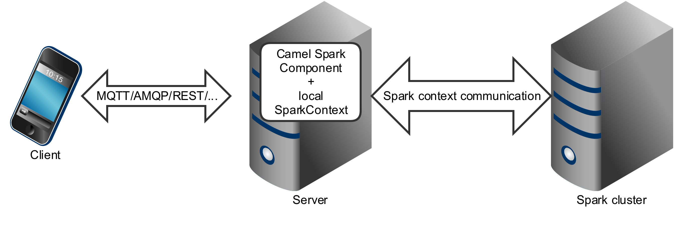
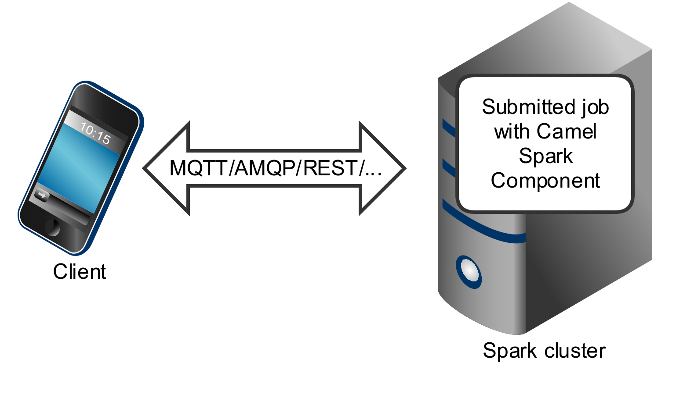

[[spark-component]]
= Spark Component

*Since Camel 2.17*

// HEADER START
*Only producer is supported*
// HEADER END

*Since Camel 2.17*

This documentation page covers the http://spark.apache.org/[Apache
Spark] component for the Apache Camel. The main purpose of the Spark
integration with Camel is to provide a bridge between Camel connectors
and Spark tasks. In particular Camel connector provides a way to route
message from various transports, dynamically choose a task to execute,
use incoming message as input data for that task and finally deliver the
results of the execution back to the Camel pipeline.

== Supported architectural styles

Spark component can be used as a driver application deployed into an
application server (or executed as a fat jar).

Spark component can also be submitted as a job directly into the Spark
cluster.

While Spark component is primary designed to work as a _long running
job_ serving as an bridge between Spark cluster and the other endpoints,
you can also use it as a _fire-once_ short job.   

== Running Spark in OSGi servers

Currently the Spark component doesn't support execution in the OSGi
container. Spark has been designed to be executed as a fat jar, usually
submitted as a job to a cluster. For those reasons running Spark in an
OSGi server is at least challenging and is not support by Camel as well.

== URI format

Currently the Spark component supports only producers - it is intended
to invoke a Spark job and return results. You can call RDD, data frame
or Hive SQL job.

*Spark URI format*

[source,java]
--------------------------
spark:{rdd|dataframe|hive}
--------------------------

=== Spark options

// component options: START
The Spark component supports 4 options, which are listed below.

[width="100%",cols="2,5,^1,2",options="header"]
|===
| Name | Description | Default | Type
| *lazyStartProducer* (producer) | Whether the producer should be started lazy (on the first message). By starting lazy you can use this to allow CamelContext and routes to startup in situations where a producer may otherwise fail during starting and cause the route to fail being started. By deferring this startup to be lazy then the startup failure can be handled during routing messages via Camel's routing error handlers. Beware that when the first message is processed then creating and starting the producer may take a little time and prolong the total processing time of the processing. | false | boolean
| *rdd* (producer) | RDD to compute against. |  | JavaRDDLike
| *rddCallback* (producer) | Function performing action against an RDD. |  | RddCallback
| *basicPropertyBinding* (advanced) | Whether the component should use basic property binding (Camel 2.x) or the newer property binding with additional capabilities | false | boolean
|===
// component options: END

// endpoint options: START
The Spark endpoint is configured using URI syntax:

----
spark:endpointType
----

with the following path and query parameters:

=== Path Parameters (1 parameters):

[width="100%",cols="2,5,^1,2",options="header"]
|===
| Name | Description | Default | Type
| *endpointType* | *Required* Type of the endpoint (rdd, dataframe, hive). The value can be one of: rdd, dataframe, hive |  | EndpointType
|===

=== Query Parameters (8 parameters):

[width="100%",cols="2,5,^1,2",options="header"]
|===
| Name | Description | Default | Type
| *collect* (producer) | Indicates if results should be collected or counted. | true | boolean
| *dataFrame* (producer) | DataFrame to compute against. |  | Dataset
| *dataFrameCallback* (producer) | Function performing action against an DataFrame. |  | DataFrameCallback
| *lazyStartProducer* (producer) | Whether the producer should be started lazy (on the first message). By starting lazy you can use this to allow CamelContext and routes to startup in situations where a producer may otherwise fail during starting and cause the route to fail being started. By deferring this startup to be lazy then the startup failure can be handled during routing messages via Camel's routing error handlers. Beware that when the first message is processed then creating and starting the producer may take a little time and prolong the total processing time of the processing. | false | boolean
| *rdd* (producer) | RDD to compute against. |  | JavaRDDLike
| *rddCallback* (producer) | Function performing action against an RDD. |  | RddCallback
| *basicPropertyBinding* (advanced) | Whether the endpoint should use basic property binding (Camel 2.x) or the newer property binding with additional capabilities | false | boolean
| *synchronous* (advanced) | Sets whether synchronous processing should be strictly used, or Camel is allowed to use asynchronous processing (if supported). | false | boolean
|===
// endpoint options: END

 
== RDD jobs 

To invoke an RDD job, use the following URI:

*Spark RDD producer*

[source,java]
------------------------------------------------------
spark:rdd?rdd=#testFileRdd&rddCallback=#transformation
------------------------------------------------------

 Where `rdd` option refers to the name of an RDD instance (subclass of
`org.apache.spark.api.java.JavaRDDLike`) from a Camel registry, while
`rddCallback` refers to the implementation
of `org.apache.camel.component.spark.RddCallback` interface (also from a
registry). RDD callback provides a single method used to apply incoming
messages against the given RDD. Results of callback computations are
saved as a body to an exchange.

*Spark RDD callback*

[source,java]
-------------------------------------------------
public interface RddCallback<T> {
    T onRdd(JavaRDDLike rdd, Object... payloads);
}
-------------------------------------------------

The following snippet demonstrates how to send message as an input to
the job and return results:

*Calling spark job*

[source,java]
------------------------------------------------------------------------------------------------------------------------------
String pattern = "job input";
long linesCount = producerTemplate.requestBody("spark:rdd?rdd=#myRdd&rddCallback=#countLinesContaining", pattern, long.class);
------------------------------------------------------------------------------------------------------------------------------

The RDD callback for the snippet above registered as Spring bean could
look as follows:

*Spark RDD callback*

[source,java]
------------------------------------------------------------------------
@Bean
RddCallback<Long> countLinesContaining() {
    return new RddCallback<Long>() {
        Long onRdd(JavaRDDLike rdd, Object... payloads) {
            String pattern = (String) payloads[0];
            return rdd.filter({line -> line.contains(pattern)}).count();
        }
    }
}
------------------------------------------------------------------------

The RDD definition in Spring could looks as follows:

*Spark RDD definition*

[source,java]
--------------------------------------------------
@Bean
JavaRDDLike myRdd(JavaSparkContext sparkContext) {
  return sparkContext.textFile("testrdd.txt");
}
--------------------------------------------------

=== Void RDD callbacks

If your RDD callback doesn't return any value back to a Camel pipeline,
you can either return `null` value or use `VoidRddCallback` base class:

*Spark RDD definition*

[source,java]
------------------------------------------------------------------
@Bean
RddCallback<Void> rddCallback() {
  return new VoidRddCallback() {
        @Override
        public void doOnRdd(JavaRDDLike rdd, Object... payloads) {
            rdd.saveAsTextFile(output.getAbsolutePath());
        }
    };
}
------------------------------------------------------------------

=== Converting RDD callbacks

If you know what type of the input data will be sent to the RDD
callback, you can use `ConvertingRddCallback` and let Camel to
automatically convert incoming messages before inserting those into the
callback:

*Spark RDD definition*

[source,java]
---------------------------------------------------------------------------
@Bean
RddCallback<Long> rddCallback(CamelContext context) {
  return new ConvertingRddCallback<Long>(context, int.class, int.class) {
            @Override
            public Long doOnRdd(JavaRDDLike rdd, Object... payloads) {
                return rdd.count() * (int) payloads[0] * (int) payloads[1];
            }
        };
    };
}
---------------------------------------------------------------------------

=== Annotated RDD callbacks

Probably the easiest way to work with the RDD callbacks is to provide
class with method marked with `@RddCallback` annotation:

*Annotated RDD callback definition*

[source,java]
-----------------------------------------------------------------------------------------------------
import static org.apache.camel.component.spark.annotations.AnnotatedRddCallback.annotatedRddCallback;
 
@Bean
RddCallback<Long> rddCallback() {
    return annotatedRddCallback(new MyTransformation());
}
 
...
 
import org.apache.camel.component.spark.annotation.RddCallback;
 
public class MyTransformation {
 
    @RddCallback
    long countLines(JavaRDD<String> textFile, int first, int second) {
        return textFile.count() * first * second;
    }
 
}
-----------------------------------------------------------------------------------------------------

If you will pass CamelContext to the annotated RDD callback factory
method, the created callback will be able to convert incoming payloads
to match the parameters of the annotated method:

*Body conversions for annotated RDD callbacks*

[source,java]
------------------------------------------------------------------------------------------------------------------------------
import static org.apache.camel.component.spark.annotations.AnnotatedRddCallback.annotatedRddCallback;
 
@Bean
RddCallback<Long> rddCallback(CamelContext camelContext) {
    return annotatedRddCallback(new MyTransformation(), camelContext);
}
 
...

 
import org.apache.camel.component.spark.annotation.RddCallback;
 
public class MyTransformation {
 
    @RddCallback
    long countLines(JavaRDD<String> textFile, int first, int second) {
        return textFile.count() * first * second;
    }
 
}
 
...
 
// Convert String "10" to integer
long result = producerTemplate.requestBody("spark:rdd?rdd=#rdd&rddCallback=#rddCallback" Arrays.asList(10, "10"), long.class);
------------------------------------------------------------------------------------------------------------------------------

 

== DataFrame jobs

Instead of working with RDDs Spark component can work with DataFrames as
well. 

To invoke an DataFrame job, use the following URI:

*Spark RDD producer*

[source,java]
--------------------------------------------------------------------------
spark:dataframe?dataFrame=#testDataFrame&dataFrameCallback=#transformation
--------------------------------------------------------------------------

 Where `dataFrame` option refers to the name of an DataFrame instance
(`instances of org.apache.spark.sql.Dataset and org.apache.spark.sql.Row`) from a Camel registry,
while `dataFrameCallback` refers to the implementation
of `org.apache.camel.component.spark.DataFrameCallback` interface (also
from a registry). DataFrame callback provides a single method used to
apply incoming messages against the given DataFrame. Results of callback
computations are saved as a body to an exchange.

*Spark RDD callback*

[source,java]
-----------------------------------------------------------
public interface DataFrameCallback<T> {
    T onDataFrame(Dataset<Row> dataFrame, Object... payloads);
}
-----------------------------------------------------------

The following snippet demonstrates how to send message as an input to a
job and return results:

*Calling spark job*

[source,java]
-----------------------------------------------------------------------------------------------------------------------------------------
String model = "Micra";
long linesCount = producerTemplate.requestBody("spark:dataFrame?dataFrame=#cars&dataFrameCallback=#findCarWithModel", model, long.class);
-----------------------------------------------------------------------------------------------------------------------------------------

The DataFrame callback for the snippet above registered as Spring bean
could look as follows:

*Spark RDD callback*

[source,java]
-------------------------------------------------------------------------------------
@Bean
RddCallback<Long> findCarWithModel() {
    return new DataFrameCallback<Long>() {
        @Override
        public Long onDataFrame(Dataset<Row> dataFrame, Object... payloads) {
            String model = (String) payloads[0];
            return dataFrame.where(dataFrame.col("model").eqNullSafe(model)).count();
        }
    };
}
-------------------------------------------------------------------------------------

The DataFrame definition in Spring could looks as follows:

*Spark RDD definition*

[source,java]
------------------------------------------------------------------------
@Bean
Dataset<Row> cars(HiveContext hiveContext) {
    Dataset<Row> jsonCars = hiveContext.read().json("/var/data/cars.json");
    jsonCars.registerTempTable("cars");
    return jsonCars;
}
------------------------------------------------------------------------

== Hive jobs

 Instead of working with RDDs or DataFrame Spark component can also
receive Hive SQL queries as payloads. To send Hive query to Spark
component, use the following URI:

*Spark RDD producer*

[source,java]
----------
spark:hive
----------

The following snippet demonstrates how to send message as an input to a
job and return results:

*Calling spark job*

[source,java]
----------------------------------------------------------------------------------------------------
long carsCount = template.requestBody("spark:hive?collect=false", "SELECT * FROM cars", Long.class);
List<Row> cars = template.requestBody("spark:hive", "SELECT * FROM cars", List.class);
----------------------------------------------------------------------------------------------------

The table we want to execute query against should be registered in a
HiveContext before we query it. For example in Spring such registration
could look as follows:

*Spark RDD definition*

[source,java]
------------------------------------------------------------------------
@Bean
Dataset<Row> cars(HiveContext hiveContext) {
     jsonCars = hiveContext.read().json("/var/data/cars.json");
    jsonCars.registerTempTable("cars");
    return jsonCars;
}
------------------------------------------------------------------------

include::camel-spring-boot::page$spark-starter.adoc[]
