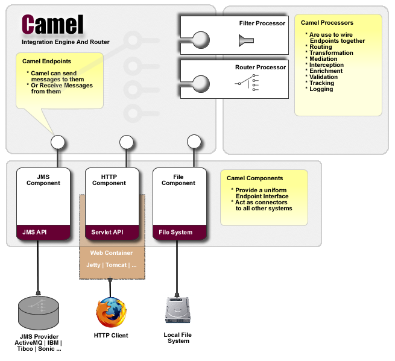

[[Architecture-Architecture]]
Architecture
~~~~~~~~~~~~

Camel uses a Java based link:dsl.html[Routing Domain Specific Language
(DSL)] or an link:xml-configuration.html[Xml Configuration] to configure
link:routes.html[routing and mediation rules] which are added to a
http://camel.apache.org/maven/current/camel-core/apidocs/org/apache/camel/CamelContext.html[CamelContext]
to implement the various
link:enterprise-integration-patterns.html[Enterprise Integration
Patterns].

At a high level Camel consists of a
http://camel.apache.org/maven/current/camel-core/apidocs/org/apache/camel/CamelContext.html[CamelContext]
which contains a collection of link:component.html[Component] instances.
A link:component.html[Component] is essentially a factory of
link:endpoint.html[Endpoint] instances. You can explicitly configure
link:component.html[Component] instances in Java code or an IoC
container like Spring or Guice, or they can be auto-discovered using
link:uris.html[URIs].

An link:endpoint.html[Endpoint] acts rather like a URI or URL in a web
application or a Destination in a JMS system; you can communicate with
an endpoint; either sending messages to it or consuming messages from
it. You can then create a
http://camel.apache.org/maven/current/camel-core/apidocs/org/apache/camel/Producer.html[Producer]
or
http://camel.apache.org/maven/current/camel-core/apidocs/org/apache/camel/Consumer.html[Consumer]
on an link:endpoint.html[Endpoint] to exchange messages with it.

The link:dsl.html[DSL] makes heavy use of pluggable
link:languages.html[Languages] to create an
link:expression.html[Expression] or link:predicate.html[Predicate] to
make a truly powerful DSL which is extensible to the most suitable
language depending on your needs. Many of the link:languages.html[Languages] 
are also supported as
link:annotation-based-expression-language.html[Annotation Based
Expression Language].

[[Architecture-Diagram]]
Diagram
~~~~~~~

