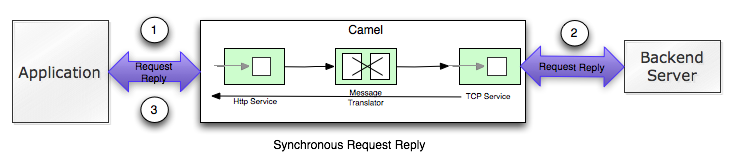
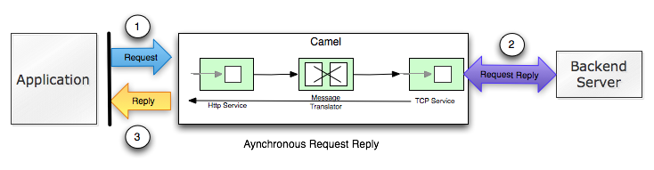

[[Async-Async]]
Async
~~~~~

*Available as of Camel 2.0*

The asynchronous API in Camel have been rewritten for Camel 2.0, and the
information on this page applies for Camel 2.0 and later.

The link:async.html[Async] API in Camel is primarily divided in two
areas +
 1. Initiating an link:async.html[Async] messaging from the client +
 2. Turning a route into link:async.html[Async] using the *threads*
link:dsl.html[DSL]

Before we look at these two areas we start with a bit of background
information and looks at the concept from at a higher level using
diagrams. +
 Then we check out the first area how a client can initiate an
link:async.html[Async] message exchange and we also throw in the
synchronous message exchange in the mix as well so we can compare and
distill the difference. +
 And finally we turn our attention towards the last area the new
*threads* DSL and what it can be used for.

[[Async-Background]]
Background
~~~~~~~~~~

The new link:async.html[Async] API in Camel 2.0 leverages in much
greater detail the Java Concurrency API and its support for executing
tasks asynchronous. +
 Therefore the Camel link:async.html[Async] API should be familiar for
users with knowledge of the Java Concurrency API.

[[Async-Afewconceptstomaster]]
A few concepts to master
^^^^^^^^^^^^^^^^^^^^^^^^

When doing messaging there are a few aspects to keep in mind.

First of all a caller can initiate a message exchange as either:

* link:event-message.html[Request only]
* link:request-reply.html[Request Reply]

link:event-message.html[Request only] is when the caller sends a message
but do *not* expect any reply. This is also known as fire and forget or
event message.

The link:request-reply.html[Request Reply] is when the caller sends a
message and then *waits for a reply*. This is like the
link:http.html[HTTP] protocol that we use every day when we surf the
web. We send a request to fetch a web page and wait until the reply message
comes with the web content.

In Camel a message is labeled with a Message
link:exchange-pattern.html[Exchange Pattern] that labels whether its a
request only or request reply message. Camel uses the link:jbi.html[JBI]
term for this an uses `InOnly` for the request only, and `InOut` for the
request reply.

For all message exchange they can be executed either:

* synchronous
* asynchronous

[[Async-SynchronousRequestReply]]
Synchronous Request Reply
+++++++++++++++++++++++++

A synchronous exchange is defined as the caller sends a message and
waits until its complete before continuing. This is illustrated in the
diagram below:

\1. The client sends a sync link:request-reply.html[Request Reply]
message over link:http.html[HTTP] to Camel. The client application will
wait for the response that Camel routes and processes. +
 2. The message invokes an external link:mina.html[TCP] service using
synchronous link:request-reply.html[Request Reply]. The client
application still waits for the response. +
 3. The response is send back to the client.

[[Async-AsynchronousRequestReply]]
Asynchronous Request Reply
++++++++++++++++++++++++++

On the other hand the asynchronous version is where the caller sends a
message to an link:endpoint.html[Endpoint] and then returns immediately
back to the caller. The message however is processed in another thread,
the asynchronous thread. Then the caller can continue doing other work
and at the same time the asynchronous thread is processing the message.
This is illustrated in the diagram below:

 1. The client sends an link:async.html[Async]
link:request-reply.html[Request Reply] message over link:http.html[HTTP]
to Camel. The control is immediately returned to the client application,
that can continue and do other work while Camel routes the message. +
 2. Camel invokes an external link:mina.html[TCP] service using
synchronous link:request-reply.html[Request Reply]. The client
application can do other work simultaneously. +
 3. The client wants to get the reply so it uses the Future handle it
got as _response_ from step 1. With this handle it retrieves the reply,
wait if nessasary if the reply is not ready.

[[Async-SynchronousRequestOnly]]
Synchronous Request Only
^^^^^^^^^^^^^^^^^^^^^^^^

You can also do synchronous link:event-message.html[Request only] with
Camel. The client sends a message to Camel in which a reply is not
expected. However the client still waits until the message is processed
completely. This is illustrated in the diagram below:

\1. The client sends a link:event-message.html[Request only] and we can
still use link:http.html[HTTP] despite http being
link:request-reply.html[Request Reply] by nature. +
 2. Camel invokes an external link:mina.html[TCP] service using
synchronous link:request-reply.html[Request Reply]. The client
application is still waiting. +
 3. The message is processed completely and the control is returned to
the client.

So why do you want to use synchronous link:event-message.html[Request
Only]? Well if you want to know whether the message was processed
successfully or not before continuing. With synchronous it allows you to
wait while the message is being processed. In case the processing was
succesful the control is returned to the client with no notion of error.
In case of failure the client can detect this as an exception is thrown.
(and `exchange.isFailed()` returns `true`).

[[Async-AsynchronousRequestOnly]]
Asynchronous Request Only
^^^^^^^^^^^^^^^^^^^^^^^^^

As opposed to the synchronous link:event-message.html[Request Only] the
link:async.html[Async] counter part will *not* wait for the processing
of the message to complete. In this case the client can immediately
continue doing other work while the message is being routed and
processed in Camel. This is illustrated in the diagram below:

\1. The client sends a link:event-message.html[Request only] and we can
still use link:http.html[HTTP] despite http being
link:request-reply.html[Request Reply] by nature. The control is
immediately returned to the client application, that can continue and do
other work while Camel routes the message. +
 2. Camel invokes an external link:mina.html[TCP] service using
synchronous link:request-reply.html[Request Reply]. The client
application can do other work simultaneously. +
 3. The message completes but no result is returned to the client.

*Notice:* As Camel always returns a `Future` handle for
link:async.html[Async] messaging to the client. The client can use this
handler to get hold of the status of the processing whether the task is
complete or an Exception occured during processing. Note that the client
is not required to do so, its perfect valid to just ignore the Future
handle.

TIP: In case you want to know whether the link:async.html[Async]
link:event-message.html[Request Only] failed, then you can use the
`Future` handle and invoke `get()` and if it throws a
`ExecutionException` then the processing failed. The caused exception is
wrapped. You can invoke `isDone()` first to test whether the task is
done or still in progress. Otherwise invoking `get()` will wait until
the task is done.

With these diagrams in mind lets turn out attention to the
link:async.html[Async] API and how to use it with Camel.

[[Async1TheClientAPI]]
The Async Client API
~~~~~~~~~~~~~~~~~~~~

Camel provides the link:async.html[Async] Client API in the
http://camel.apache.org/maven/current/camel-core/apidocs/org/apache/camel/ProducerTemplate.html[ProducerTemplate]
where we have added about 10 new methods to Camel 2.0. We have listed
the most important in the table below:

[width="100%",cols="10%,10%,80%",options="header",]
|=======================================================================
|Method |Returns |Description

|setExecutorService |void |Is used to set the Java ExecutorService. Camel will by default provide a
ScheduledExecutorService with 5 thread in the pool.

|asyncSend |Future<Exchange> |Is used to send an async exchange to a Camel
link:endpoint.html[Endpoint]. Camel will imeddiately return control to
the caller thread after the task has been submitted to the executor
service. This allows you to do other work while Camel processes the
exchange in the other async thread.

|asyncSendBody |Future<Object> |As above but for sending body only. This is a request only messaging
style so no reply is expected. Uses the `InOnly` exchange pattern.

|asyncRequestBody |Future<Object> |As above but for sending body only. This is a
link:request-reply.html[Request Reply] messaging style so a reply is
expected. Uses the `InOut` exchange pattern.

|extractFutureBody |T |Is used to get the result from the asynchronous thread using the Java
Concurrency Future handle.
|=======================================================================

The `asyncSend` and `asyncRequest` methods return a Future handle. This
handle is what the caller must use later to retrieve the asynchronous
response. You can do this by using the `extractFutureBody` method, or
just use plain Java but invoke `get()` on the `Future` handle.

[[Async-TheClientAPIwithcallbacks]]
The link:async.html[Async] Client API with callbacks
^^^^^^^^^^^^^^^^^^^^^^^^^^^^^^^^^^^^^^^^^^^^^^^^^^^^

In addition to the Client API from above Camel provides a variation that
uses link:oncompletion.html[callbacks] when the message
link:exchange.html[Exchange] is done.

[width="100%",cols="10%,10%,80%",options="header",]
|=======================================================================
|Method |Returns |Description

|asyncCallback |Future<Exchange> |In addition a callback is passed in as a parameter using the
`org.apache.camel.spi.Synchronization` Callback. The callback is invoked
when the message exchange is done.

|asyncCallbackSendBody |Future<Object> |As above but for sending body only. This is a request only messaging
style so no reply is expected. Uses the `InOnly` exchange pattern.

|asyncCallbackRequestBody |Future<Object> |As above but for sending body only. This is a
link:request-reply.html[Request Reply] messaging style so a reply is
expected. Uses the `InOut` exchange pattern.
|=======================================================================

These methods also returns the Future handle in case you need them. The
difference is that they invokes the callback as well when the
link:exchange.html[Exchange] is done being routed.

[[Async-TheFutureAPI]]
The Future API
++++++++++++++

The `java.util.concurrent.Future` API have among others the following
methods:

[width="100%",cols="10%,10%,80%",options="header",]
|=======================================================================
|Method |Returns |Description

|isDone |boolean |Returns a boolean whether the task is done or not. Will even return
`true` if the tasks failed due to an exception thrown.

|get() |Object |Gets the response of the task. In case of an exception was thrown the
`java.util.concurrent.ExecutionException` is thrown with the caused
exception.
|=======================================================================

[[Async-Example:AsynchronousRequestReply]]
Example: Asynchronous Request Reply
^^^^^^^^^^^^^^^^^^^^^^^^^^^^^^^^^^^

Suppose we want to call a link:http.html[HTTP] service but it is usually
slow and thus we do not want to block and wait for the response, as we
can do other important computation. So we can initiate an
link:async.html[Async] exchange to the link:http.html[HTTP] endpoint and
then do other stuff while the slow link:http.html[HTTP] service is
processing our request. And then a bit later we can use the `Future`
handle to get the response from the link:http.html[HTTP] service. Yeah
nice so lets do it:

First we define some routes in Camel. One for the link:http.html[HTTP]
service where we simulate a slow server as it takes at least 1 second to
reply. And then other route that we want to invoke while the
link:http.html[HTTP] service is on route. This allows you to be able to
process the two routes simultaneously:

And then we have the client API where we call the two routes and we can
get the responses from both of them. As the code is based on unit test
there is a bit of mock in there as well:

All together it should give you the basic idea how to use this
link:async.html[Async] API and what it can do.

[[Async-Example:SynchronousRequestReply]]
Example: Synchronous Request Reply
^^^^^^^^^^^^^^^^^^^^^^^^^^^^^^^^^^

This example is just to a pure synchronous version of the example from
above that was link:async.html[Async] based.

The route is the same, so its just how the client initiate and send the
messages that differs:

[[Async-UsingtheAPIwithcallbacks]]
Using the link:async.html[Async] API with callbacks
^^^^^^^^^^^^^^^^^^^^^^^^^^^^^^^^^^^^^^^^^^^^^^^^^^^

Suppose we want to call a link:http.html[HTTP] service but it is usually
slow and thus we do not want to block and wait for the response, but
instead let a callback gather the response. This allows us to send
multiple requests without waiting for the replies before we can send the
next request.

First we define a route in Camel for the link:http.html[HTTP] service
where we simulate a slow server as it takes at least 1 second to reply.

Then we define our callback where we gather the responses. As this is
based on an unit test it just gathers the responses in a list. This is a
shared callback we use for every request we send in, but you can use
your own individual or use an anonymous callback. The callback supports
different methods, but we use `onDone` that is invoked regardless if the
link:exchange.html[Exchange] was processed successfully or failed. The
`org.apache.camel.spi.Synchronization` API provides fine grained methods
for `onCompletion` and `onFailure` for the two situations.

And then we have the client API where we call the link:http.html[HTTP]
service using `asyncCallback` 3 times with different input. As the
invocation is link:async.html[Async] the client will send 3 requests
right after each other, so we have 3 concurrent exchanges in progress.
The response is gathered by our callback so we do not have to care how
to get the response.

[[Async-UsingtheAPIwiththeCamelclassicAPI]]
Using the link:async.html[Async] API with the Camel classic API
^^^^^^^^^^^^^^^^^^^^^^^^^^^^^^^^^^^^^^^^^^^^^^^^^^^^^^^^^^^^^^^

When using the Camel API to create a producer and send an
link:exchange.html[Exchange] we do it like this:

[source,java]
---------------------------------------------------------------------------
Endpoint endpoint = context.getEndpoint("http://slowserver.org/myservice");
Exchange exchange = endpoint.createExchange();
exchange.getIn().setBody("Order ABC");
// create a regular producer
Producer producer = endpoint.createProducer();
// send the exchange and wait for the reply as this is synchronous
producer.process(exchange);
---------------------------------------------------------------------------

But to do the same with link:async.html[Async] we need a little help
from a helper class, so the code is:

[source,java]
------------------------------------------------------------------------------------------------------------------------------
Endpoint endpoint = context.getEndpoint("http://slowserver.org/myservice");
Exchange exchange = endpoint.createExchange();
exchange.getIn().setBody("Order ABC");
// create a regular producer
Producer producer = endpoint.createProducer();
// normally you will use a shared exectutor service with pools
ExecutorService executor = Executors.newSingleThreadExecutor();
// send it async with the help of this helper
Future<Exchange> future = AsyncProcessorHelper.asyncProcess(executor, producer, exchange);
// here we got the future handle and we can do other stuff while the exchange is being routed in the other asynchronous thread
...
// and to get the response we use regular Java Concurrency API
Exchange response = future.get();
------------------------------------------------------------------------------------------------------------------------------

[[Async2UsingtheThreadsDSL]]
Using the Threads DSL
~~~~~~~~~~~~~~~~~~~~~

In Camel 2.0 the `threads` DSL replaces the old `thread` DSL.

[[Async-Camel2.0to2.3behavior]]
Camel 2.0 to 2.3 behavior
^^^^^^^^^^^^^^^^^^^^^^^^^

The `threads` DSL leverages the JDK concurrency framework for multi
threading. It can be used to turn a synchronous route into
link:async.html[Async]. What happens is that from the point forwards
from `threads` the messages is routed asynchronous in a new thread. The
caller will either wait for a reply if a reply is expected, such as when
we use link:request-reply.html[Request Reply] messaging. Or the caller
will complete as well if no reply was expected such as
link:event-message.html[Request Only] messaging.

[[Async-Camel2.4onwardsbehavior]]
Camel 2.4 onwards behavior
^^^^^^^^^^^^^^^^^^^^^^^^^^

The `threads` DSL leverages the JDK concurrency framework for multi
threading. It can be used to turn a synchronous route into
link:async.html[Async]. What happens is that from the point forwards
from `threads` the messages is routed asynchronous in a new thread.
Camel leverages the link:asynchronous-processing.html[asynchronous
routing engine], which was re-introduced in Camel 2.4, to continue
routing the link:exchange.html[Exchange] asynchronously.

The `threads` DSL supports the following options:

[width="100%",cols="10%,90%",options="header",]
|=======================================================================
|Option |Description

|poolSize |A number to indicate the core pool size of the underlying Java
`ExecutorService` that is actually doing all the heavy lifting of
handling link:async.html[Async] tasks and correlate replies etc. By
default a pool size of 10 is used.

|maxPoolSize |A number to indicate the maximum pool size of the of the underlying Java
`ExecutorService`

|keepAliveTime |A number to indicate how long to keep inactive threads alive

|timeUnit |Time unit for the `keepAliveTime` option

|maxQueueSize |A number to indicate the maximum number of tasks to keep in the worker
queue for the underlying Java `ExecutorService`

|threadName |To use a custom thread name pattern. See
link:threading-model.html[Threading Model] for more details.

|rejectedPolicy |How to handle rejected tasks. Can be either `Abort`, `CallerRuns`,
`Discard`, or `DiscardOldest`. See below for more details.

|callerRunsWhenRejected |A boolean to more easily configure between the most common rejection
policies. This option is default enabled. `true` is the same as
`rejectedPolicy=CallerRuns`, and `false` is the same as
`rejectedPolicy=Abort`.

|executorService |You can provide a custom `ExecutorService` to use, for instance in a
managed environment a J2EE container could provide this service so all
thread pools is controlled by the J2EE container.

|executorServiceRef |You can provide a named reference to the custom `ExecutorService` from
the Camel registry. Keep in mind that reference to the custom executor
service cannot be used together with the executor-related options (like
`poolSize` or `maxQueueSize`) as referenced executor service should be
configured already.

|waitForTaskToComplete |*@deprecated (removed in Camel 2.4):* Option to specify if the caller
should wait for the async task to be complete or not before continuing.
The following 3 options is supported: *Always*, *Never* or
*IfReplyExpected*. The first two options is self explained. The last
will only wait if the message is link:request-reply.html[Request Reply]
based. The default option is *IfReplyExpected*.
|=======================================================================

[[Async-Aboutrejectedtasks]]
About rejected tasks
++++++++++++++++++++

The `threads` DSL uses a thread pool which has a worker queue for tasks.
When the worker queue gets full, the task is rejected. You can customize
how to react upon this using the `rejectedPolicy` and
`callerRunsWhenRejected` option. The latter is used for easily switch
between the two most common and recommended settings. Either let the
current caller thread execute the task (eg it will become synchronous),
but also give time for the thread pool to process its current tasks,
without adding more tasks - sort of self throttling. This is the default
behavior. If setting `callerRunsWhenRejected` you use the `Abort`
policy, which mean the task is rejected, and a
`RejectedExecutionException` is set on the link:exchange.html[Exchange],
and the link:exchange.html[Exchange] will stop continue being routed,
and its `UnitOfWork` will be regarded as failed.

The other options `Discard` and `DiscardOldest` works a bit like
`Abort`, however they do *not* set any Exception on the
link:exchange.html[Exchange], which mean the
link:exchange.html[Exchange] will *not* be regarded as failed, but the
link:exchange.html[Exchange] will be successful. When using `Discard`
and `DiscardOldest` then the link:exchange.html[Exchange] will not
continue being routed. *Notice:* There is a issue with these two options
in Camel 2.9 or below, that cause the `UnitOfWork` not to be triggered,
so we discourage you from using these options in those Camel releases.
This has been fixed in Camel 2.10 onwards.

[[Async-Example:threadsDSL]]
Example: threads DSL
^^^^^^^^^^^^^^^^^^^^

Suppose we receive orders on a JMS queue. Some of the orders expect a
reply while other do not (either a `JMSReplyTo` exists or not). And lets
imagine to process this order we need to do some heavy CPU calculation.
So how do we avoid the messages that does not expect a reply to block
until the entire message is processed? Well we use the `threads` DSL to
turn the route into multi threading asynchronous routing before the
heavy CPU task. Then the messages that does not expect a reply can
return beforehand. And the messages that expect a reply, well yeah they
have to wait anyway. So this can be accomplished like the route below:

WARNING: *Transactions and threads DSL*
Mind that when using transactions its often required that the
link:exchange.html[Exchange] is processed entirely in the same thread,
as the transaction manager often uses `ThreadLocal` to store the
intermediate transaction status. For instance Spring Transaction does
this. So when using `threads` DSL the link:exchange.html[Exchange] that
is processed in the async thread cannot participate in the same
transaction as the caller thread.
*Notice:* This does not apply to the `ProducerTemplate` Async API as
such as the client usually does not participate in a transaction. So you
can still use the Camel Client Async API and do async messaging where
the processing of the link:exchange.html[Exchange] is still handled
within transaction. Its only the client that submitted the
link:exchange.html[Exchange] that does not participate in the same
transaction.

[[Async-SeeAlso]]
See Also
^^^^^^^^

* link:asynchronous-processing.html[Asynchronous Processing]
* link:request-reply.html[Request Reply]
* link:event-message.html[Request Only]
*
http://davsclaus.blogspot.com/2009/05/on-road-to-camel-20-concurrency-with.html[Blog
entry on using async for concurrent file processing]
* link:seda.html[SEDA]
* link:direct.html[Direct]
* link:toasync.html[ToAsync] for non blocking
link:request-reply.html[Request Reply]

