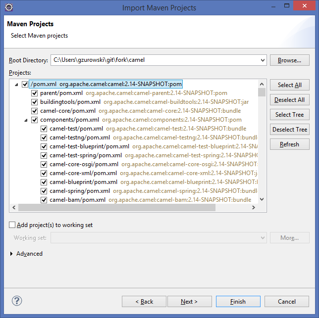
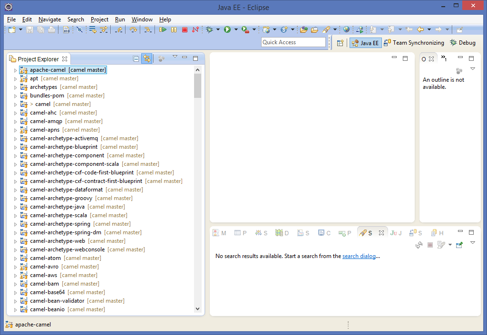

[[Building-BuildingCamelfromSource]]
Building Camel from Source
~~~~~~~~~~~~~~~~~~~~~~~~~~

Camel uses http://maven.apache.org/[Maven] as its build and management
tool. If you don't fancy using Maven you can use your IDE directly or
link:download.html[Download] a distribution or JAR.

[[Building-Prequisites]]
Prequisites
^^^^^^^^^^^

*Required:*

* Download and http://maven.apache.org/download.html[install Maven] +
 (Maven 3.1.1 or newer is required to build Camel 2.14 onwards) +
(Maven 3.2.5 or newer is required to build Camel 2.18 onwards) 
* Get the latest link:source.html[Source]
* Java 
(1.7 or 1.8 to build Camel 2.14 onwards) 
(1.8 to build Camel 2.18 onwards) 

*Optional:*

* http://www.princexml.com/download/[Prince] should be in the executable
PATH to generate the PDF documentation

[[Building-Mavenoptions]]
Maven options
^^^^^^^^^^^^^

To build camel maven has to be configured to use more memory

[[Building-UnixLinuxMac]]
Unix/Linux/Mac

[source,text]
------------------------------------------------------------
export MAVEN_OPTS="-Xms2048m -Xmx2048m -XX:MaxPermSize=512m"
------------------------------------------------------------

For Camel 2.18:

[source,text]
------------------------------------------------------------
export MAVEN_OPTS="-XX:+UseConcMarkSweepGC -Xms2048m -Xmx2048m"
------------------------------------------------------------

[[Building-Windows]]
Windows

[source,text]
-------------------------------------------------------
set MAVEN_OPTS=-Xms2048m -Xmx2048m -XX:MaxPermSize=512m
-------------------------------------------------------

For Camel 2.18:

[source,text]
------------------------------------------------------------
set MAVEN_OPTS="-XX:+UseConcMarkSweepGC -Xms2048m -Xmx2048m"
------------------------------------------------------------

[[Building-Anormalbuild]]
A normal build
^^^^^^^^^^^^^^

[source,text]
-----------------
mvn clean install
-----------------

[[Building-Anormalbuildwithoutrunningtests]]
A normal build without running tests
^^^^^^^^^^^^^^^^^^^^^^^^^^^^^^^^^^^^

[source,text]
-------------------------------
mvn clean install -Pfastinstall
-------------------------------

[[Building-Anormalbuildwithoutrunningtestsbutcheckstyleverificationenabled]]
A normal build without running tests but checkstyle verification enabled
^^^^^^^^^^^^^^^^^^^^^^^^^^^^^^^^^^^^^^^^^^^^^^^^^^^^^^^^^^^^^^^^^^^^^^^^

[source,text]
-------------------------------------------
mvn clean install -Pfastinstall,sourcecheck
-------------------------------------------

[[Building-DoingaQuickBuild]]
Doing a Quick Build
^^^^^^^^^^^^^^^^^^^

*Available as of Camel 2.6*

The following skips building the manual, the distro and does not execute
the unit tests.

[source,text]
-------------------------
mvn install -Pfastinstall
-------------------------

[[Building-UsinganIDE]]
Using an IDE
^^^^^^^^^^^^

If you prefer to use an IDE then you can auto-generate the IDE's project
files using maven plugins. e.g.

[[Building-IntelliJ]]
IntelliJ
++++++++

[source,text]
-------------
mvn idea:idea
-------------

[[Building-Eclipse]]
Eclipse
+++++++

There are several ways to import the projects into Eclipse.

[[Building-m2e]]
m2e

Starting with Camel 2.14.0, Camel can be imported into Eclipse using m2e
Maven integration.

Before you start: It is important to run Eclipse with at least 1.5 GB of
heap memory, otherwise the import process will fail. To increase the
heap size, edit the "eclipse.ini" file and set the -Xmx parameter as
follows:

*eclipse.ini*

[source,java]
---------
[...]
-Xmx1536m
---------

[[Building-CloningtheGitRepository]]
Cloning the Git Repository 

Either follow instructions about getting the latest
link:source.html[source], or clone the Git repository with Eclipse by
selecting "File -> Import -> Git / Projects from Git" and "Clone URI".
Provide all repository details in the import wizard and clone the
repository into a directory outside of the Eclipse workspace. Once
cloning has completed, exit the import project wizard (i.e. simply
select cancel when asked to select "Wizard for project import").

[[Building-ImportMavenProjects]]
Import Maven Projects

Import Camel projects as Maven projects using m2e by selecting "File ->
Import -> Maven -> Existing Maven Projects". Point the wizard to the
root directory of the cloned repository. Eclipse will analyze all Camel
projects and eventually present the following summary:

Simply confirm the import of all projects by clicking "Finish". The
import process will create Eclipse projects and automatically set up
build paths using dependency details provided by the pom.xml files. Once
completed, all Camel projects will be available in your workspace:

[[Building-maven-eclipse-plugin]]
maven-eclipse-plugin

The maven-eclipse-plugin can be used to generate the
.classpath/.project/.settings file that Eclipse need. To do this, run:

[source,text]
----------------------------------------
mvn process-test-sources eclipse:eclipse
----------------------------------------

or

[source,text]
-------------------------------------------------------------------
mvn -Psetup.eclipse -Declipse.workspace.dir=/path/to/your/workspace
-------------------------------------------------------------------

The latter is recommended as it would completely setup the workspace for
you as well as provide options to wire in other projects also found in
your workspace.

After running the above command, from within Eclipse, do "File -> Import
-> Existing Projects into Workspace", select the root camel checkout
location and Eclipse should find all the projects.

[[Building-AddingCamelEclipsetemplatestoyourworkspace]]
Adding Camel Eclipse templates to your workspace

The above mentioned setup.eclipse profile does a few additional things
to your workspace:

1.  Adds the Camel code templates (see
http://janstey.blogspot.com/2008/08/eclipse-templates-for-apache-camel.html[here])
2.  Sets the M2_REPO variable in the workspace that points to your local
Maven repository (i.e., `~/.m2/repository` on Unix and
`c:\Documents and Settings\<user>\.m2\repository` on Windows) which
allows the jars to be resolved.

[[Building-Hint:specifytheworkspacelocationinyour.m2/settings.xml]]
Hint: specify the workspace location in your .m2/settings.xml

You can add a profile to your .m2/settings.xml to specify your eclipse
workspace location so you can avoid having to type that each time you
need to update the projects.

[source,xml]
--------------------------------------------------------------------------
<profiles>
    <profile>
        <id>setup.eclipse</id>
        <properties>
            <eclipse.workspace>/path/to/your/workspace</eclipse.workspace>
        </properties>
    </profile>
</profiles>
--------------------------------------------------------------------------

[[Building-Buildingwithcheckstyle]]
Building with checkstyle
^^^^^^^^^^^^^^^^^^^^^^^^

To enable source style checking with checkstyle, build Camel with the
-Psourcecheck parameter

[source,text]
-------------------------------
mvn -Psourcecheck clean install
-------------------------------

[[Building-Buildingsourcejars]]
Building source jars
^^^^^^^^^^^^^^^^^^^^

If you want to build jar files with the source code, that for instance
Eclipse can important so you can debug the Camel code as well. Then you
can run this command from the camel root folder:

[source,text]
------------------------------------------
mvn clean source:jar install -Pfastinstall
------------------------------------------

[[Building-Workingwithkaraffeatures]]
Working with karaf features
^^^^^^^^^^^^^^^^^^^^^^^^^^^

If you change anything in the features.xml from `platform/karaf` you can
run a validation step to ensure the generated features.xml file is
correct. You can do this running the following maven goal from the
`platform` directory.

[source,text]
----------------------------
mvn clean install -Pvalidate
----------------------------

[[Building-ExecutingunittestsusingEkstazi]]
Executing unit tests using Ekstazi
^^^^^^^^^^^^^^^^^^^^^^^^^^^^^^^^^^

Normally, when you execute the unit tests during your development cycle
for a particular component, you are executing all the tests each time.
This may become inefficient, when you are changing one class and the
effect of this change is limited within the component having many unit
tests. Ekstazi is a regression testing tool that can keep track of the
test results and the changed classes so that unaffected tests can be
skipped during the subsequent testing. For more details of Ekstazi,
please refer to the Ekstazi page
at http://www.ekstazi.org[http://www.ekstazi.org].

To use Ekstazi, you can run the tests with the maven profile ekstazi.

[source,text]
------------------
mvn test -Pekstazi
------------------

[[Building-SeeAlso]]
See Also
^^^^^^^^

* link:running-unit-tests.html[Running Unit Tests]
* link:source.html[Source]
* link:examples.html[Examples]

