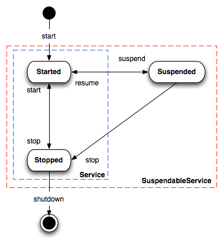

[[Lifecycle-CamelLifecycle]]
Camel Lifecycle
~~~~~~~~~~~~~~~

Camel uses a simple _lifecycle_ interface called
http://camel.apache.org/maven/current/camel-core/apidocs/org/apache/camel/Service.html[Service]
which has a single start() and stop() method.

Various classes implement Service such as
link:camelcontext.html[CamelContext] along with a number of
link:component.html[Component] and link:endpoint.html[Endpoint] classes.

When you use Camel you typically have to start the
link:camelcontext.html[CamelContext] which will start all the various
components and endpoints and activate the routing rules until the
context is stopped again.

If you are working with Spring you may wish to read the
link:spring.html[Camel Spring documentation].

[[Lifecycle-CamelContextLifecycle]]
CamelContext Lifecycle
^^^^^^^^^^^^^^^^^^^^^^

The `CamelContext` provides methods to control its lifecycle:

* `start`
* `stop`
* `suspend` *Camel 2.5*
* `resume` *Camel 2.5*

The operations is paired: start/stop and suspend/resume.

Stop is performing a link:graceful-shutdown.html[Graceful shutdown]
which means all its internal state, cache, etc is cleared. And the
routes is being stopped in a graceful manner to ensure messages is given
time to complete. If you start a `CamelContext` after a stop, then its
performing a _cold_ start, recreating all the state, cache etc. again.

Instead you can use the suspend/resume operations. They will keep the
`CamelContext` _warm_ and only suspend/stop routes using the same
link:graceful-shutdown.html[Graceful shutdown] feature. This ensures
messages is given time to complete.

End users is encouraged to use suspend/resume if you are temporary
stopping a Camel application.

All these operations is available in link:camel-jmx.html[JMX] as well,
so you can control Camel from a management console.

If you write unit tests and perform _cold_ restarts using stop/start
then any previously looked up link:endpoint.html[Endpoint]s etc. is
obsolete, and therefore you need to re-lookup those endpoints again.

Instead use suspend/resume which keeps these
link:endpoint.html[Endpoint]s and therefore you can still use them after
resuming.

[[Lifecycle-Servicelifecycle]]
Service lifecycle
^^^^^^^^^^^^^^^^^

A service (`org.apache.camel.Service`) in Camel adheres to the following
lifecycle states as illustrated in the diagram below:

*Notice:* A service can optimally support suspend/resume by the
`org.apache.camel.SuspendableService`. This means not all services in
Camel supports suspension. It's encouraged that consumers support
suspension which allows to suspend/resume routes.

The `org.apache.camel.impl.ServiceSupport` is a good base class to
extend for custom services as it offers the basic functionally to keep
track of state. You implement your custom logic in the `doStart`,
`doStop`, `doSuspend`, `doResume` methods.

[[Lifecycle-Routeslifecycle]]
Routes lifecycle
^^^^^^^^^^^^^^^^

Routes in Camel have the following operations to control its lifecycle

* `start`
* `stop`
* `suspend`
* `resume`
* `remove` (previously named shutdown)

The `remove` operation will *remove* the route, for example in
link:camel-jmx.html[JMX] the route will then be unregistered and its
gone. So only use remove if you really want to remove the route. The
route must have been stopped before you can remove.

The `start` and `resume` operations in link:camel-jmx.html[JMX] checks
the state beforehand. So if a route is stopped and you click `resume`,
it will know to invoke `start`. And likewise if a route has been
suspended and you click `start` it knows to `resume` instead. This makes
management a bit easier.

If a route is suspended then it keeps its resources and all their JMX
metrics alive. Where as stopping a route will graceful stop the route,
and clear its resources, and as well their JMX metrics. If you want to
temporary "pause" a route, then consider using suspend/resume over
stop/start.

If a route consumer does not support suspension, it will fallback and
stop the route instead.

[[Lifecycle-SeeAlso]]
See Also
^^^^^^^^

* link:camelcontext.html[CamelContext]
* link:architecture.html[Architecture]
* link:camel-jmx.html[JMX]

