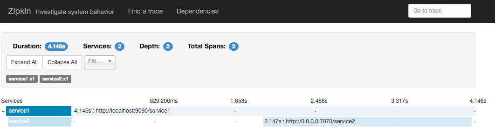
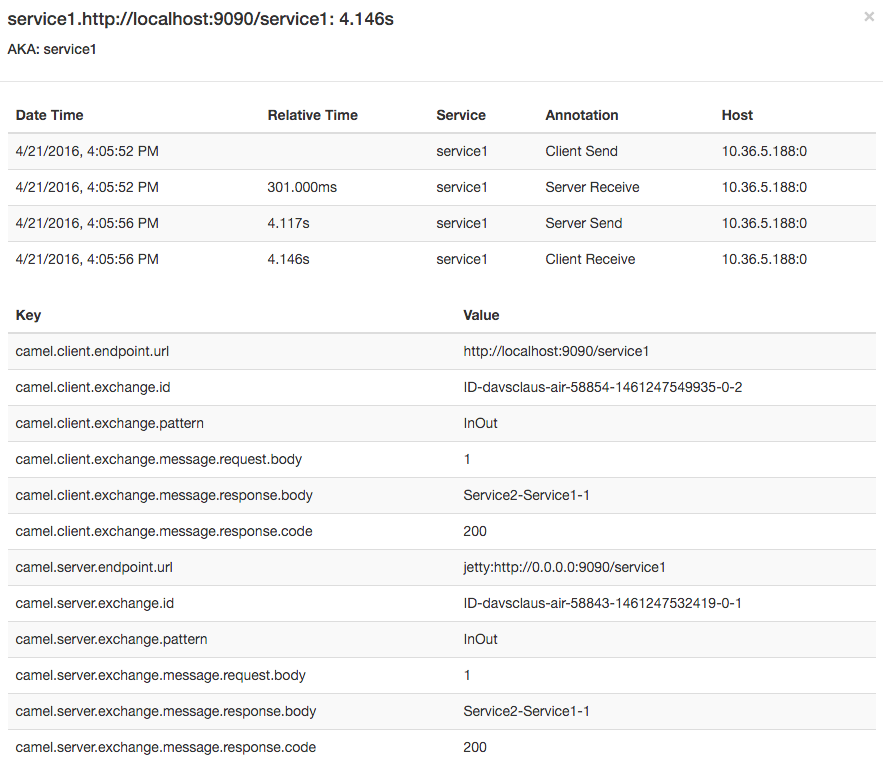

# Zipkin Example

### Introduction

This example shows how to use Camel with Zipkin to trace/timing all incoming and outgoing Camel messages.

The example requires a running Zipkin Server.

The example includes three sub maven modules that implement

- client
- service1
- service2

Where client -> service1 -> service2 using HTTP.

### Configuration

Service1 is configured in the `src/main/java/sample/camel/Service1Application.java` source code.
Service2 is configured in the `src/main/resources/application.properties` properties file.

Here you need to configure the hostname and port number for the Zipkin Server.

### Build

You will need to compile this example first:

```sh
$ mvn compile
```

### Run the example

Then using three different shells and run service1 and service2 before the client.

```sh
$ cd service1
$ mvn compile spring-boot:run
```

When service1 is ready then start service2

```sh
$ cd service2
$ mvn compile camel:run
```

And then start the client that calls service1 every 30th seconds.

```sh
$ cd client
$ mvn compile camel:run
```

### Zipkin web console

You should be able to visualize the traces and timings from this example using the Zipkin Web Console.
The services are named `service1` and `service2`.

In the screen shot below we are showing a trace of a client calling service1 and service2.



You can then click on each span and get annotated data from the Camel exchange and about the requests as shown:




### Installing Zipkin Server using Docker

If you want to try Zipkin locally then you quickly try that using Docker.

There is a [quickstart guide at zipkin](http://zipkin.io/pages/quickstart.html) that has further instructions.
Remember to configure the IP address and port number in the `application.properties` file.

You can find the IP using `docker-machine ls`

### Forum, Help, etc

If you hit an problems please let us know on the Camel Forums
<http://camel.apache.org/discussion-forums.html>

Please help us make Apache Camel better - we appreciate any feedback you may
have. Enjoy!

The Camel riders!
